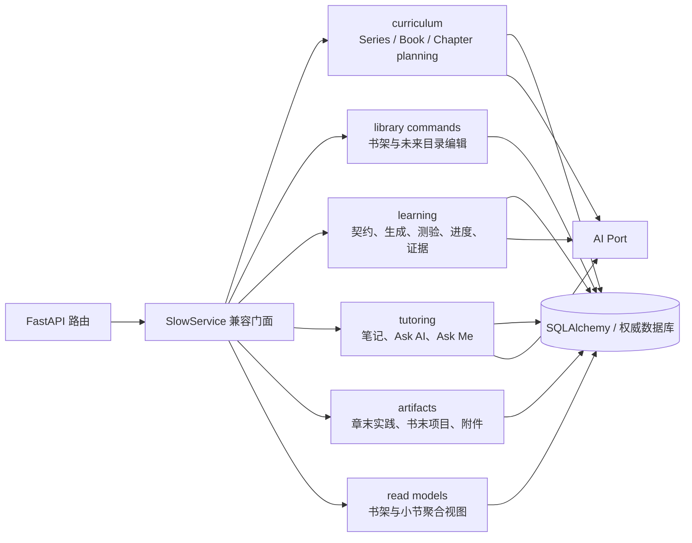

# ADR-0003：应用模块化单体边界

- **状态**：Accepted，第一阶段已实现
- **决策日期**：2026-08-07
- **适用范围**：FastAPI 应用服务、课程生成、学习交互、读模型与持久化
- **关联决策**：[ADR-0001](0001-lesson-generation-v2.md)、[ADR-0002](0002-curriculum-planning-boundaries.md)

## 1. 背景

早期 MVP 将课程规划、目录编辑、小节读取、学习任务、笔记、答疑、口试、实践附件和反馈修复集中在 `SlowService`。统一入口方便验证纵向闭环，但继续把业务规则加入同一类会产生三个问题：

- 事务和写入权边界难以辨认；
- 课程生成、学习证据和展示投影容易彼此反向依赖；
- 测试只能通过大入口验证，局部规则难以独立演进。

当前阶段仍是产品验证期，不引入网络边界、独立数据库或分布式事务。

## 2. 决策

后端保持一个进程、一个部署单元、一个权威数据库，按业务能力拆成模块化单体。HTTP 路由暂时继续依赖 `SlowService` 兼容门面，门面只负责组装依赖和转发，不再承载新增业务规则。

模块是代码和写入权边界，不是微服务，也不是新增产品层级。

## 3. 当前模块职责

| 模块 | 权威职责 | 不负责 |
| --- | --- | --- |
| `curriculum` | Series 路线、书籍章节校准、章内小节规划和数量策略 | 正文发布、学习解锁 |
| `library` | 用户显式创建书架、软删除、未来章节增删改排 | AI 课程规划 |
| `learning` | Learning Contract、生成任务、测验、进度、里程碑和证据 | 目录展示拼装 |
| `tutoring` | 学习笔记、段落绑定问答、Ask Me 口试 | 修改课程目标、替代正式测验 |
| `artifacts` | 章末实践、书末项目、附件归属和提交 | 小节测验与解锁 |
| `read_models` | 从权威事实拼装书架、书籍和小节响应 | 反向写入权威状态 |

## 4. 依赖规则

1. 路由只依赖应用门面或明确的应用用例，不直接修改 ORM 实体。
2. 写模块可以读取共享权威模型，但不得通过读模型回写状态。
3. 读模型只组装投影，不提交事务、不触发模型生成。
4. 跨模块协作通过窄接口或注入的 callable 完成；禁止重新创建一个全能模块。
5. AI 输出必须继续经过原有 Schema、Learning Contract、失败关闭和原子发布门禁。
6. 拆分不得改变用户 → 书架 → Series → 书 → 章 → 节的产品层级。

## 5. 迁移策略

采用渐进式绞杀：先把完整能力迁出，再在 `SlowService` 保留同名薄转发，以保持 API 和测试稳定。新业务规则直接进入所属模块；当路由全部改为明确用例后，再删除兼容门面。

第一阶段已经迁出：

- Series、Book、Chapter 的分层课程规划；
- 书架及未来章节目录命令；
- 小节聚合读模型；
- 章末实践、书末项目和附件；
- 学习笔记、Ask AI 和 Ask Me。

仍留在兼容门面中的反馈修复流、学习任务调度和记忆投影将在后续独立迁移。它们在迁出前不得继续吸收其他模块规则。

## 6. 验收

- 现有 HTTP 契约和错误码保持不变；
- 全量 API 测试通过；
- `SlowService` 对已迁出能力只保留依赖组装和薄转发；
- 不新增服务间网络调用、数据库或消息基础设施。
