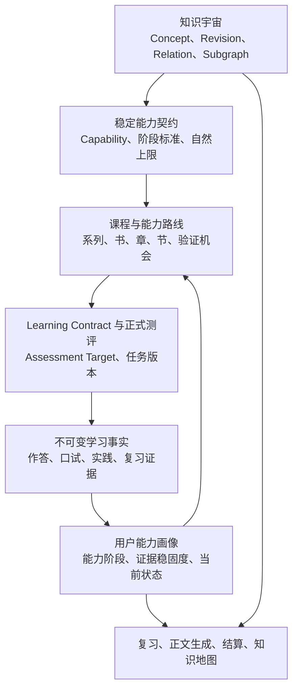

# ADR-0022：基于知识子网的稳定能力、累计阶段与三轴用户画像

- **状态**：Accepted，跨系列知识与能力发布身份链路已实现
- **决策日期**：2026-08-15
- **适用范围**：知识图谱、稳定能力身份、课程规划、Learning Contract、正式测评、复习、能力画像、段位结算、知识地图与正文个性化
- **继承边界**：[ADR-0001](0001-lesson-generation-v2.md)、[ADR-0012](0012-on-demand-knowledge-universe-and-learner-memory.md)、[ADR-0015](0015-rank-settleable-learning-contracts.md)、[ADR-0020](0020-audited-historical-rank-identity.md)、[ADR-0021](0021-series-local-knowledge-identity-resolution.md)
- **取代范围**：取代 ADR-0012、ADR-0015 中“知识节点直接拥有六级段位”“`recognition/mechanism/application/boundary/transfer` 直接映射青铜至钻石”“跨时间稳定直接形成大师段位”的规则。知识身份、版本化量规、不可变证据、追加式身份裁决、可重建投影和失败关闭原则继续有效。

## 1. 背景

节末结算可能同时展示“符号主义”“达特茅斯会议”“第一次 AI 寒冬”等多张青铜卡。表面问题是卡片过多，实质问题是系统曾按“系列 ID + 完整目标句子”创建段位节点：具体目标首次通过后获得青铜，后续课程却未必再次原样考查，因此用户看不到真实、可完成的晋级路径。

ADR-0021 已先解决一部分知识身份问题：同一系列跨书的精确知识候选可以复用同一 Concept Revision，Assessment Target 与 Concept 不再等同。但当前段位规则仍混合三种语义：

1. 机制、应用、边界、迁移是不同能力或任务特征；
2. 多次、跨情境、跨时间属于证据成熟度；
3. 当前活跃、可能生疏、待重新验证属于可调用状态。

旧算法以最强维度直接确定段位，可能从青铜跳到铂金或钻石；黄金可能没有真实验证入口；时间稳定可能被误读为更高能力。只合并前端卡片或把六个枚举改成四个枚举都不能解决这些问题。

## 2. 总体决策

Slow 将知识、稳定能力、课程路线、考核目标、原始证据和用户画像明确分层：



知识宇宙回答“学的是什么”；稳定能力契约回答“用户要使用这些知识完成什么”；正式测评只产生事实；版本化投影器从合格事实重建用户画像；复习、正文生成与界面只能消费画像，不能反向制造掌握事实。

## 3. 知识宇宙与知识子网边界

知识宇宙继续以 `Concept`、`ConceptRevision` 和版本化类型关系为权威。节点必须具有稳定身份、定义、范围、边界、来源与发布状态；关系可以表达前置、组成、机制依赖、对比、应用、迁移和易混淆。

一个能力所需的知识范围以显式、版本化知识子网冻结，至少包含：

- 锚定的 Concept Revision；
- 必需与支撑节点的角色；
- 必须理解或操作的 Relation Version；
- 子网边界和允许情境；
- 采用的知识发布版本或系列内候选裁决版本。

以下规则不可破坏：

- 知识节点不再直接承担用户段位身份；
- 图上相邻、正文提及或作为脚手架出现，不等于进入正式能力或考核范围；
- 同名不等于同一知识，未发布候选不能跨系列自动合并；
- 知识关系不能自动传播掌握，综合任务正确不能让所有相邻节点一起升级；
- 书、章、节仍是教学路线，知识节点和关系不得成为新的目录或解锁层级。

## 4. 稳定能力身份

### 4.1 定义

稳定能力表示：学习者在明确知识子网、操作要求、情境和约束下可以完成的一类可观察行为。能力不是知识节点、考题、课程章节或用户状态。

建议领域模型：

```text
Capability
└── CapabilityRevision
    ├── capability_scope
    ├── operation
    ├── context_constraints
    ├── natural_stage_ceiling
    ├── CapabilityConceptBinding[]
    ├── CapabilityRelationRequirement[]
    └── CapabilityStageCriterion[]
```

一项能力可以绑定多个 Concept Revision；一个 Concept Revision 也可以服务多项能力。例如“符号主义”“达特茅斯会议”“第一次 AI 寒冬”继续作为知识节点存在，而“解释 AI 学科形成、早期繁荣与低谷之间的关系”是一项引用这些节点及其关系的稳定能力。

### 4.2 身份范围

能力身份分为：

- `published_capability`：经过发布，可跨系列复用；
- `route_scoped_capability`：当前系列内稳定复用，等待后续裁决；
- `unresolved_capability`：存在粒度、语义或边界冲突，不能静默合并。

能力候选和身份决定必须追加记录候选内容、比较对象、决定、依据、规则版本、模型版本、执行者和 supersedes 链。不得按标题相似度迁移历史证据。

## 5. 四级累计能力阶段

单项稳定能力采用四级累计阶段：

| 阶段 | 用户语义 | 统一要求 |
| --- | --- | --- |
| 青铜 · 说得出 | 能辨认并说明核心含义 | 正确识别对象、必要关系或核心结论 |
| 白银 · 讲得清 | 能解释机制、关系和常见混淆 | 形成可归因的解释，处理必要边界与反例 |
| 黄金 · 做得到 | 能无辅助完成未见过的标准任务 | 在标准情境中独立选择并使用所学 |
| 钻石 · 能迁移 | 能在陌生或综合情境中运用 | 在变化情境中重组知识并解释选择依据 |

每个 `CapabilityRevision` 必须冻结本地 `CapabilityStageCriterion`，说明每一级具体要完成什么、采用何种任务、允许何种辅助、需要何种新颖性和情境。统一阶段名称不能替代能力本地量规。

晋级规则：

1. 必须逐级累计满足，禁止跳级；
2. 当前阶段的全部必需标准和所有前置阶段必须成立；
3. 高阶证据不能自动填补低阶缺失标准；
4. 能力可以声明自然阶段上限，没有真实高阶任务时不得展示不存在的路径；
5. 边界与反例属于白银、黄金或钻石任务的标准，不再独占一个段位；
6. `recognition/mechanism/application/boundary/transfer` 只作为知识操作、任务特征或历史审计字段，不直接决定阶段；
7. 单次最强证据、最高分或单一概率阈值都不能直接确定阶段。

“大师”不再授予零碎知识节点或单项窄能力。未来如保留“大师”，它只能是能力主题、一本书或一个系列的综合成就，要求关键能力覆盖、综合迁移和跨时间独立验证，并显式保留关键缺口。

## 6. 证据稳固度与当前可用状态

能力画像必须正交保存三条轴：

### 6.1 能力阶段

`capability_stage` 回答用户目前能够完成多复杂的任务，并保存 `current_stage`、`highest_stage`、已满足标准和缺失标准。

### 6.2 证据稳固度

`evidence_maturity` 回答能力判断有多少独立、跨情境和跨时间证据，至少包括独立证据数、不同任务族、不同情境数、延迟验证数和最近可靠验证时间。

星级可以作为稳固度的用户表达，但证据数量或星级不能直接制造升段。

### 6.3 当前可用状态

`activation_state` 表达当前活跃、可能生疏、待重新验证或正在学习。时间经过只能改变可用状态和复习到期信息，不能直接降低历史最高阶段，也不能仅凭时钟断言能力已经下降。

## 7. 课程规划与能力路线

系列生成时必须冻结 `CapabilityRouteBinding`，至少回答：

- 本系列最终要形成哪些稳定能力；
- 每项能力采用哪个 Capability Revision；
- 系列期望达到什么阶段及其自然上限；
- 哪本书、哪一章、哪一节负责教学和推进；
- 哪个正式任务负责验证哪个 Stage Criterion；
- 路线中下一次正式验证机会在哪里。

规划门禁：

- 声明黄金目标时必须存在未见标准任务；
- 声明钻石目标时必须存在陌生或综合迁移任务；
- 找不到真实验证入口时，必须降低自然上限或失败重规划；
- 能力路线不能把支撑知识静默升级为目标；
- 课程规划只承诺验证机会，不能预先宣称用户已经达到阶段。

## 8. Learning Contract 与 Assessment Target

Learning Contract 继续是小节正式教学和验证范围的权威。新的 Assessment Target 必须绑定：

```text
AssessmentTarget
├── capability_revision_id
├── stage_criterion_id
├── concept_revision_ids
├── required_relation_ids
├── task_type
├── novelty_requirement
├── assistance_limit
├── context_requirement
├── attribution_policy
└── verification_protocol
```

Assessment Target 回答“本次要验证什么”，不能与 Concept 或 Capability 混为一物。同一能力可以有多个阶段标准和多个任务；同一知识子网可以被不同能力以不同操作方式使用。

现有“节末选择题及格后解锁”的产品规则继续有效，但节末选择题主要承担基础校验和青铜证明。它可以诊断更高阶段缺口，却不能仅凭选对就证明用户能主动解释、独立应用或迁移。

## 9. 正式任务与证据资格

不同任务承担不同职责：

| 任务入口 | 主要证据职责 |
| --- | --- |
| 节末选择题 | 解锁、基础识别、青铜阶段 |
| Ask Me | 机制解释、关系、混淆与必要边界，主要服务白银 |
| 到期复习中的未见标准任务 | 无辅助标准应用，主要服务黄金 |
| 陌生或综合任务 | 情境迁移与知识重组，主要服务钻石 |
| 章末或书末实践 | 多项能力的可归因综合验证 |

黄金任务采用独立权威链，不能由“章节实践已提交”或“开放题字数足够”替代：

```text
CapabilityApplicationTaskVersion
→ CapabilityApplicationSubmission
→ CapabilityApplicationEvaluation
→ AssessmentObservation + EvidenceQualificationEvent
→ CapabilityStateProjection
```

任务版本必须绑定已冻结的 Learning Contract、已发布正文版本、唯一 application Assessment Target 与 gold Stage Criterion，并保存题面、交付物、冻结量规、参考判定要点、新颖性比较依据和作者血缘。提交记录原始回答、当前学习实例、幂等键与辅助声明；评定记录逐项结果、证据充分性、评定者血缘与资格结论。任务作者与正式评定者必须来自不同模型家族。量规漏项、总评与逐项结果矛盾、同模型家族、辅助作答、本地 Demo、正文题面复制或缺少白银前置时一律不能形成黄金证据。

“未见过”的首个确定性边界是：任务题面不得复制或高度近似当前冻结正文块，并保存被比较块的稳定 ID。该检查证明任务不是已发布题面的直接重放，不等同于语义事实核验；任务仍需模型作者按标准新实例生成，并由真实学习表现和离线评测持续治理。

每次正式学习事实至少记录：

- 用户、Learning Contract、Assessment Target 和任务版本；
- Capability Revision 与 Stage Criterion；
- 绑定的 Concept/Relation Version；
- 结果与可归因范围；
- 是否独立完成、使用何种辅助；
- 是否见过同一任务或任务族；
- 情境指纹与新颖性；
- 与上次可靠验证的间隔；
- 证据资格、来源模式和规则版本。

正式测评期间不得继续教学。补救后即时重复、相同题目重放、受提示完成和无法归因的综合结果必须降低或取消晋级资格，不能伪装成独立证据。

## 10. 用户知识子网、能力画像与学习者画像

### 10.1 用户知识子网

记录用户路线和合格证据涉及哪些 Concept Revision、关系、来源和当前激活范围。它不再给每个零碎知识节点直接发段位。

### 10.2 用户能力画像

建议权威投影：

```text
CapabilityStateProjection
├── current_stage
├── highest_stage
├── satisfied_criterion_ids
├── missing_criterion_ids
├── evidence_maturity
├── activation_state
├── stability
├── next_due_at
├── next_stage_requirement
├── next_assessment_opportunity
├── source_evidence_watermark
└── projection_rule_version
```

投影器是唯一写入者。模型、前端、课程规划、缓存和用户自述都不得直接覆盖能力画像。规则升级、证据资格变化或身份裁决后必须能够从不可变事实重建。

### 10.3 学习者画像

跨多个能力、情境和时间窗口归纳稳定的能力结构、复习节奏、表达偏好与反复出现的障碍。单次错题、一次 Ask Me 或模型判断不能形成稳定画像；画像也不能反向修改原始证据或能力阶段。

## 11. 复习系统边界

复习不再以错题列表为主轴。复习选择器读取能力画像和路线，按以下信号排序：

1. 已到期且需要唤醒的能力；
2. 当前阶段缺少的必需标准；
3. 路线即将再次使用但证据不足的能力；
4. 只有单一任务族或单一情境证据的能力；
5. 最近错题及其诊断；
6. 题型、情境和证据来源的必要多样性。

正式流程为：

```text
选择能力缺口
→ 选择阶段标准
→ 选择任务类型与新颖性要求
→ 生成并确定性校验
→ 用户独立完成
→ 写入不可变事实
→ 重建能力画像
```

错题复习只是诊断和补强来源之一。复习不能因为用户曾经答错就机械重复原题，也不能在没有到期、阶段缺口或路线需要时制造虚假复习任务。

## 12. 对正文生成和上层产品的反向作用

正文生成只读取当前任务相关的最小知识子网、能力画像和路线机会：

- 已达到白银的内容减少基础重复；
- 缺黄金标准时增加标准应用教学，但不伪造能力证据；
- 能力到期时先安排短唤醒；
- 前置薄弱时增加非考核脚手架；
- 前置缺口过大时显式重规划；
- 已达到钻石时进入更复杂或更综合的任务。

正文生成器不得创建正式知识身份、正式能力身份、扩展 Learning Contract，或根据画像直接制造掌握事实。

节末结算、知识地图、系列进度和下一步提示统一读取 `CapabilityStateProjection`：普通用户看到稳定能力、当前阶段、稳固情况、是否需要唤醒和下一项可完成任务；不得暴露内部 ID、原始概率、证据水位、规则枚举或模型 rationale。

## 13. 数据权威与写入边界

| 数据 | 唯一权威与写入者 |
| --- | --- |
| Concept Revision、Relation Version、知识子网发布 | 知识发布与身份裁决服务 |
| Capability Revision、阶段标准 | 能力量规发布服务 |
| Capability Route Binding | 课程规划服务，经服务端确定性校验 |
| Learning Contract、Assessment Target | 契约服务 |
| 作答、口试、实践、复习事实 | 测评服务 |
| Capability State Projection | 版本化能力投影器 |
| 复习候选与任务计划 | 复习选择器 |
| 前端卡片、动画与展开状态 | 客户端临时展示，不得反写权威数据 |

完整链路必须能够追溯：

```text
知识发布或候选裁决版本
→ Capability Revision
→ Capability Route Binding
→ Learning Contract
→ Assessment Target 与任务版本
→ 原始学习事实
→ 投影规则版本与证据水位
→ 用户看到的阶段、稳固度和当前状态
```

## 14. 新旧体系迁移

迁移采用追加式、双轨投影，不原地修改历史事实：

1. 新增 Capability、Revision、知识子网绑定和 Stage Criterion；
2. 新增 Capability Route Binding 和正式验证机会；
3. 为新 Assessment Target 增加能力、阶段标准和任务协议绑定；
4. 新事实开始记录新颖性、辅助、情境和证据资格；
5. 建立 `CapabilityStateProjection v1`，从原始事实重放；
6. 不能精确映射到新能力或阶段标准的旧事实保持 `unresolved`；
7. 旧知识节点 `rank` 和结算结果保留为只读审计，不作为新版画像权威；
8. 新旧投影先影子对比，再依次切换开发者审计、生成上下文、复习、节末结算、知识地图和系列进度；
9. 切换验收完成后停止旧段位投影写入，但不删除旧表、旧事实或旧规则版本；
10. 身份晋升、合并或规则升级只触发投影重建，不改写来源事实。

## 15. 实施顺序

### 阶段 A：权威模型

- Capability、Capability Revision；
- 知识子网绑定；
- 四级 Stage Criterion 与自然上限；
- 数据库迁移和确定性校验。

### 阶段 B：能力路线与正式任务

- 系列能力路线；
- 晋级入口门禁；
- Assessment Target 新绑定；
- 选择题、Ask Me、复习任务和实践的证据资格协议。

### 阶段 C：三轴投影与历史重放

- 累计阶段算法；
- evidence maturity；
- activation state；
- 历史证据解析、unresolved 队列和影子对比。

### 阶段 D：上层切换

- 复习选择器；
- 正文生成上下文；
- 节末结算；
- 知识地图和系列能力进度；
- 旧段位停止写入。

## 16. 第一阶段不做的事情

- 不引入图数据库；
- 不预生成完整学科知识图；
- 不按名称或向量相似度自动迁移历史证据；
- 不把四级阶段退化成新的积分或全局难度排行榜；
- 不先修改卡片文案来伪装能力体系已经完成；
- 不在缺少真实黄金或钻石任务时展示虚假晋级路径；
- 不删除旧段位、旧证据或历史审计链。

## 17. 最低验收

1. “符号主义”“达特茅斯会议”“第一次 AI 寒冬”等知识节点可以共同支撑一项稳定能力，而不会各自生成永远停留在青铜的段位卡。
2. 同一稳定能力跨书出现时复用同一 Capability Revision 和用户能力画像。
3. 白银、黄金、钻石必须在前置阶段和本地必需标准全部满足后逐级获得，任何单条高阶证据都不能跳级。
4. 选择题不能单独证明主动解释、独立应用或迁移。
5. 证据数量和跨时间稳定只更新 evidence maturity，不直接制造升段。
6. 时间到期只更新 activation state，不删除历史最高阶段。
7. 系列声明黄金或钻石目标时可以定位到真实、版本化的正式任务；缺失时规划失败或降低自然上限。
8. 错题只是复习选择信号之一；复习能根据到期状态、阶段缺口和路线机会生成不同任务。
9. 新版画像能够从不可变事实和确定规则版本完整重建。
10. 无法精确迁移的旧证据保持 unresolved，不按标题或相似度静默合并。
11. 正文生成、复习、结算和知识地图最终读取同一份 Capability State Projection。
12. 普通用户只看到稳定能力、阶段、稳固情况、当前状态和下一项任务，不看到内部治理字段。

## 18. 当前实现状态

ADR-0021 的系列内知识候选、追加式身份裁决、跨书 Concept Revision 复用和 Assessment Target 维度分离已经形成第一条知识身份薄切片。

本 ADR 的第一阶段影子链路已经实现：

- 新增不依赖具体课程基准的 `KnowledgeNetwork` / `KnowledgeNetworkRevision`，网络以精确 Concept Revision 成员、稳定 `KnowledgeRelation` / `KnowledgeRelationRevision` 和不可变内容哈希形成通用发布边界；原有 `KnowledgeGraphRelease` 只作为知识来源之一，不再承担唯一网络身份；
- 新增 `CapabilitySubnet`：每个新 `CapabilityRevision` 必须冻结一个确定 Knowledge Network Revision、唯一锚点、必需/支撑节点及版本化关系要求；多必需节点必须由必需关系连通，缺节点、越界关系、删除关系或哈希漂移均失败关闭；
- 新增多节点、多关系 Assessment Target 范围绑定；阶段目标只绑定 `anchor` / `required` 节点，`supporting` 节点不能静默成为考核目标，关系按 `minimum_stage` 进入对应白银、黄金或钻石目标；
- route-scoped 单概念能力也统一经过知识网络和能力子网创建，只是合法地形成单节点最小子网，不再存在绕过子网的正式新建路径；
- 章节规划协议新增章级 `capability_subnets` 候选：通过小节位置引用精确知识身份，冻结唯一验证小节、节点角色、必需关系、能力操作、边界和自然上限；规划器只提出候选，服务端在章节发布事务内解析知识身份并创建正式子网；
- 新增追加式 `CapabilityPlanningCandidate` / `CapabilityPlanningDecision` 和 `KnowledgeRelationCandidate` / `KnowledgeRelationIdentityDecision`；同一系列内相同能力键或关系端点族出现不同语义时进入 `unresolved` 并使章节规划失败，不能静默创建另一项能力；
- 新增经审核的跨系列 `PublishedConceptIdentity`、`PublishedRelationIdentity` 和 `PublishedCapabilityIdentity` 注册表，以及统一追加式 `IdentityPublicationDecision`；未发布候选仍严格限制在当前系列，只有精确语义已经取得发布身份时，其他系列才能确定性复用；
- 发布服务以一个能力规划候选为原子审核范围，先解析并发布概念版本，再发布关系版本、冻结发布级知识网络，最后发布稳定能力版本；首次发布形成新身份，精确相同语义形成复用，家族语义变化默认进入 `unresolved`，只有显式指定被取代的发布记录后才能形成新版本；
- 新版本继续挂在原 `Concept`、`KnowledgeRelation` 或 `Capability` 稳定身份下，并以 `supersedes` 链连接前一不可变 Revision；章节规划命中发布级能力后直接建立当前系列的路线绑定，Learning Contract 与 Assessment Target 使用 `published_capability` 身份，不再克隆 route-scoped 能力；
- 规划指定的 Assessment Target 直接引用已冻结 Capability Revision 和青铜 Stage Criterion，Learning Contract 同时冻结该目标的全部必需 Concept Revision 与关系范围，不再根据目标句子临时猜测知识组合；
- 新增 `CapabilityRouteBinding`；能力自然上限可达黄金，但路线在只存在选择题时仅承诺青铜，冻结两项正式口试目标后提升到白银，只有发布真实标准应用任务后才提升到黄金；投影器同时受能力自然上限和路线正式上限约束；
- 新 Assessment Target 显式绑定 Capability Revision 和青铜 Stage Criterion；
- 正式证据新增独立的 `capability` 资格事件；Ask Me 机制解释和边界辨析分别绑定两个独立白银标准，只有两者都取得强证据且青铜已满足时才能升白银；
- Learning Contract 将选择题门禁目标与 `diagnostic_only` 口试目标分开冻结；选择题生成、内容治理和派生题链路确定性排除诊断目标；
- 迁移口试只使用显式诊断协议，不等同于正式陌生迁移任务，即使强通过也不能形成钻石证据；
- 新增版本化标准应用任务、不可变提交与独立评定事实；黄金任务必须是未见构造任务，任务作者和评定者模型家族分离，完整覆盖冻结量规且无辅助通过后才形成 gold criterion 证据；
- 正式钻石迁移任务复用同一条不可变任务、提交、独立评定和证据投影链，但使用独立 `transfer_task_v1` 协议；任务必须绑定自然上限为钻石的连通能力子网，冻结至少两项必需知识的重组要求、陌生情境依据、决策理由要求和情境指纹；只有已达黄金、无辅助且经独立模型家族充分评定的通过结果才能形成 diamond criterion 证据；
- 迁移口试与正式迁移任务使用不同 Assessment Target 和验证协议：口试继续定位迁移缺口，不能被误投影为钻石；系列路线只有先存在黄金标准应用入口，再发布正式迁移任务后才会把正式上限提升到钻石；
- 本地 Demo 可以演示标准应用和迁移任务的评定状态机，但任务与证据机器可识别为 `local_demo` / `published_demo`，永远不能提升正式能力阶段；
- 复习选择器 `review_assignment_v2_capability_priority` 已接入 Capability State：同一能力跨多个 Assessment Target 的到期需要只选择一次，到期能力唤醒优先于近期错题补强，错题在没有更高优先级能力需要时仍作为次级信号保留；选择结果面向用户返回能力阶段和复习原因；
- `CapabilityStateProjection v1` 从不可变事实重建能力阶段、证据成熟度和激活状态；
- 累计投影要求逐级满足，选择题即使沿用旧体系的 `transfer` 维度，也只能满足所绑定的青铜标准；
- 旧六级知识节点段位继续只读兼容，新画像并行生成，正文生成上下文优先消费新能力状态；
- 数据库迁移、跨书能力复用、禁止跳级、旧钻石/新青铜双轨差异和真实答题链路已有自动化测试。

仍未完成的范围：

- 按缺失 Stage Criterion 选择口试、标准应用或迁移任务的多题型复习规划；当前到期唤醒仍使用受治理的新选择题，只形成保持证据，不能借复习选择题制造黄金或钻石；
- 历史旧证据的显式解析与 unresolved 队列；
- 节末结算、知识地图和系列能力进度切换到新画像；
- 旧六级段位停止写入。

因此当前状态可以称为“知识与能力身份、青铜至钻石正式证据链路已实现”，但还不能称为整份 ADR 已实现；复习编排、历史证据迁移和上层画像切换仍未完成，任何现有六级段位结果仍只是旧规则输出。
